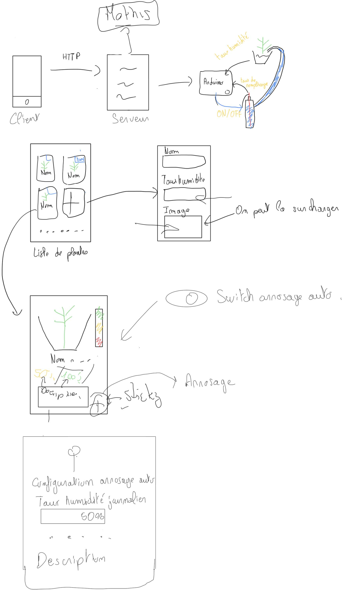

# Introduction

Ce projet a pour but de développer un système d'arrosage automatique. Le but est simple : pouvoir réaliser un suivi des plantes rapidement depuis un site Web.
Les fonctionnalités majeures de ce projet et ce que devra réaliser notre application sera : 

- Consulter la liste des plantes de notre domicile
- Consulter le détail d'un:e plante
- Arroser ses plantes automatiquement
  - en fonction du taux d'humidité
  - en puisant dans une source d'eau
- Arroser ses plantes manuellement 
  - depuis l'interface, sur chaque plante

Pour tout ce qui est arrosage, il y a une vérification du taux de remplissage de la source d'eau pour voir si elle est suffisante

# Conception

Durant la première séance, on a réalisé un brainstorming initial :

La maquette et quelques interactions avec le client

Schéma d'interaction client-serveur

## Détail d'une plante

Pour récupérer le détail de plante et les mesures associées, on va tout d'abord récupérer les données de la plante associée
sur la base de données. Une fois les informations de la plante récupérées depuis notre backend, on peut demander à l'ESP32, 
via une requête HTTP, les mesures prises par les capteurs associées à la plante

Comment on a associé les capteurs aux plantes ?

En base de données, on stocke dans une table l'association entre les plantes et les capteurs reliées au pot.